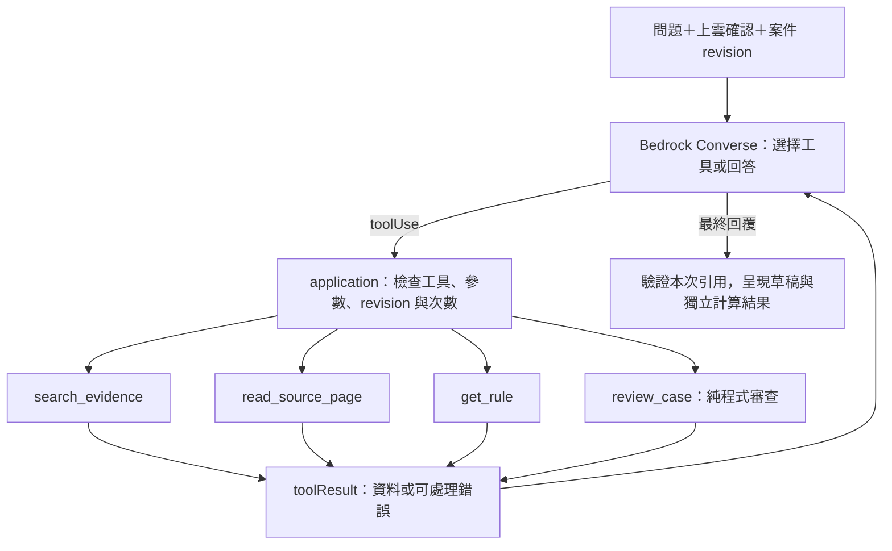

# Agentic RAG：由 Bedrock 選擇本機 functions

這是 Bedrock Converse 原生 tool calling 的 client-side Agentic RAG：模型提出 toolUse，本機 application 執行已註冊函式，再把 toolResult 回傳模型，模型可改寫問題、繼續查找或結束回答。沒有建立受管 Amazon Bedrock Agent、Knowledge Base 或 Lambda action group。

## 依 Codebase 選出的四個工具

| Function | 對應現有程式 | 用途與邊界 |
| --- | --- | --- |
| search_evidence(question) | EvidenceRetriever → LocalEvidenceRetriever.retrieve | 改寫查詢、搜尋已上傳且適用本案的來源；基準、地區、日期由後端固定 |
| read_source_page(citation_id, start) | ReviewRepository.evidence_sources | 從本次已取得引用讀取同頁最多 2000 字元，可用 next_start 繼續；不接受路徑或任意文件 ID |
| get_rule(rule_id) | ReviewRepository.get_rules | 查看案件綁定版本的單一因素設定；不代表原文已核准 |
| review_case() | domain.engine.review | 使用已保存案件與選定規則執行確定性審查；不保存新版本或修改確認 |

Codebase 由開發時盤點，工具清單及 JSON Schema 定義在 application/agent_contracts.py。模型只選擇清單內函式；不是將 Python 檔案交給模型動態執行。PDF 文件則沿用來源庫上傳與 PaddleOCR 流程，沒有自動讀取 .env、任意磁碟路徑或整個 aws 資料夾。

## 操作

1. 在案件內開啟「依據問答」，加入該基準版本及適用期間的 PDF。
2. 填寫問題，例如「幫我找寬度依據，再看目前案件有哪些審查疑點」。
3. 確認問題、案件資料與來源文件都符合上雲規範，再按「Agent 自動查詢」。此模式可把工具取得的規則及審查數值送至 AWS，與只送文件片段的一般 RAG 不同。
4. 畫面列出實際使用的工具與成功／錯誤狀態。引用可回到原始 PDF；「程式審查結果」直接顯示引擎輸出，不由模型重新計算。

一般「本機查找來源」與「AWS 生成說明」仍可使用。Agent 查詢不需要固定的工具順序，例如搜尋沒有命中時可自行換詞；不是每次都會呼叫四個工具。

## 工具迴圈

## 執行邊界

- application/agentic_rag.py 編排迴圈與工具執行，domain 保留估價運算。infrastructure/bedrock_agent.py 只轉換 Converse 的 toolUse／toolResult 訊息。
- 每次查詢最多 5 輪模型回應、8 次工具呼叫；單輪共用剩餘工具預算，最多 8 個工具。超限回傳明確錯誤，不無限循環。每次模型嘗試仍受既有共用鎖、節流與有限重試控制。
- 工具名稱及參數由 Pydantic 驗證，額外欄位拒收；不提供 eval、shell、任意 Python、保存、套用修正或修改規則的工具。
- 案件 revision 在開始、每次模型呼叫前後及工具執行前核對；中途修改就中止。純計算使用開始時已保存的快照。
- 問題、原文及工具內容視為資料。文件指令不能擴充工具權限。工具錯誤回傳固定訊息與本案合法 ID，模型可在預算內修正參數。get_rule 的 schema 也列出精確的因素 ID，不接受基準 ID 前綴。
- 每段最終說明必須引用本次已取得的來源 ID；來源不足時無生成答案，但若曾呼叫 review_case，仍顯示真實審查結果。引用存在不代表語意支持，仍須人工核對。
- 最終 JSON／引用格式錯誤或工具失敗後提前結束時，最多送一次修正回饋，仍計入五輪總上限。錯誤引用不會顯示；若已完成 review_case，最終答案仍無效時保留程式審查並顯示警語。原生截斷輸出、工具格式錯誤與超限仍回 503。
- 工具紀錄是名稱與狀態，不是模型思考過程；不輸出隱藏推理。原始 assistant continuation 僅在 adapter 往返中保留。

API：`POST /api/cases/{id}/agent-evidence`，body 為 `{"revision":1,"question":"寬度依據與審查","cloud_data_approved":true}`。回傳沿用 RAG hits／statements，增加 tool_trace 與 review；review 未呼叫時為 null。未同意回 400、過期 revision 回 409、模型或預算錯誤回 503。

模型沿用 BEDROCK_MODEL_ID，必須支援所選區域的 Converse tool calling。沒有自動跨區或改模型；不相容時回傳設定錯誤。本機替身可驗證原生訊息協定與完整工具迴圈，但不等於實際帳號／模型呼叫成功。

## 驗證依據

使用合成來源及 scripted model 驗證：改寫查詢→閱讀文件→查看規則→程式審查→附引用回答、工具白名單、跨來源拒讀、revision 衝突、循環上限、錯誤引用與快取。Converse client 替身另外驗證 toolConfig、toolUseId、toolResult 及 continuation；瀏覽器驗證同意、工具紀錄及獨立審查區塊。

協定依 [AWS client-side tool use](https://docs.aws.amazon.com/bedrock/latest/userguide/tool-use-client-side.html)。實際區域模型相容性及回答品質仍需使用合成資料做雲端 smoke 驗證；未部署受管 Bedrock Agents，也未導入 GraphRAG。

## 小型 AWS 驗收

已完成六題合成實測，包含 get_rule 與 review_case；本次 prompt 升版避免把檢查 ID 當成文件引用。重跑指令、初始失敗及最終結果見 [Agent 驗收](agent-evaluation.md)。
